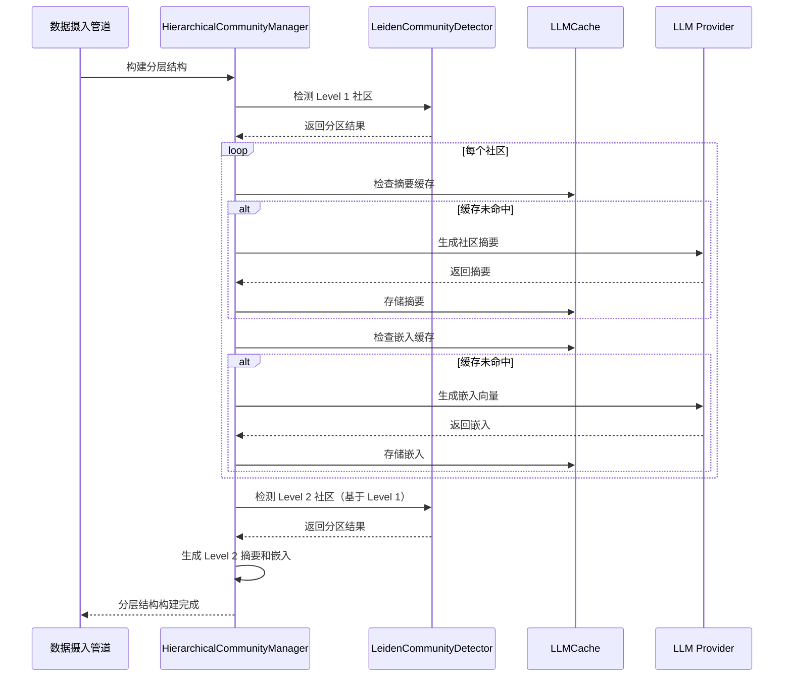
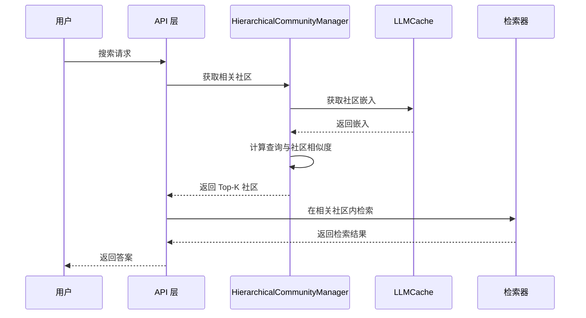

# Phase 1 优化设计：分层社区检测 + LLM 缓存层

## 概述

本设计文档描述 Phase 1 的两个核心优化：
1. **分层社区检测**：使用 Leiden 算法实现 3 级分层社区结构
2. **LLM 缓存层**：为所有 LLM 调用添加缓存，降低成本和延迟

## 目标

| 指标 | 当前 | 目标 |
|------|------|------|
| 社区检测质量 | Louvain（中等） | Leiden（高） |
| 分层支持 | 单层 | 3 级分层 |
| LLM 调用缓存 | 仅查询缓存 | 全量缓存 |
| 预期收益 | - | 检索精度 +30%，成本 -40% |

## 架构设计

### 整体架构

```
┌─────────────────────────────────────────────────────────────┐
│                    Phase 1 架构                              │
├─────────────────────────────────────────────────────────────┤
│                                                             │
│  ┌─────────────┐    ┌─────────────┐    ┌─────────────┐     │
│  │  Leiden     │    │  分层社区   │    │  社区嵌入   │     │
│  │  算法模块   │───▶│  检测模块   │───▶│  生成模块   │     │
│  └─────────────┘    └─────────────┘    └─────────────┘     │
│         │                  │                  │            │
│         ▼                  ▼                  ▼            │
│  ┌─────────────────────────────────────────────────────┐   │
│  │                   LLM 缓存层                         │   │
│  │  ┌───────────┐  ┌───────────┐  ┌───────────┐       │   │
│  │  │ 摘要缓存  │  │ 嵌入缓存  │  │ 查询缓存  │       │   │
│  │  └───────────┘  └───────────┘  └───────────┘       │   │
│  └─────────────────────────────────────────────────────┘   │
│                                                             │
└─────────────────────────────────────────────────────────────┘
```

### 分层社区结构

```
Level 0: 实体级（单个实体，最细粒度）
    │
    ├── 实体: 高血压、糖尿病、阿司匹林...
    │
    ▼
Level 1: 社区级（相关实体聚类）
    │
    ├── 社区 0: 心血管疾病（高血压、冠心病、硝苯地平...）
    ├── 社区 1: 内分泌疾病（糖尿病、胰岛素...）
    ├── 社区 2: 呼吸系统疾病（肺炎、哮喘...）
    │
    ▼
Level 2: 全局级（整个图谱摘要）
    │
    └── 全局摘要: 医疗知识图谱概览
```

## 模块设计

### 1. Leiden 社区检测模块

**文件**: `backend/src/core/leiden_detector.py`

**职责**:
- 使用 Leiden 算法替代 Louvain
- 支持递归分层检测
- 提供社区质量评估

**接口设计**:

```python
class LeidenCommunityDetector:
    """基于 Leiden 算法的社区检测器"""
    
    def __init__(self, resolution: float = 1.0):
        self.resolution = resolution
    
    def detect_communities(self, graph: nx.Graph) -> Dict[str, int]:
        """检测单层社区
        
        Args:
            graph: NetworkX 图对象
            
        Returns:
            节点到社区ID的映射
        """
        
    def detect_hierarchical(
        self, 
        graph: nx.Graph, 
        levels: int = 3
    ) -> List[Dict[str, int]]:
        """递归检测分层社区
        
        Args:
            graph: NetworkX 图对象
            levels: 分层级别数
            
        Returns:
            每层的节点到社区ID映射列表
        """
        
    def compute_modularity(
        self, 
        graph: nx.Graph, 
        partition: Dict[str, int]
    ) -> float:
        """计算分区模块度（质量评估）"""
```

**依赖**:
- `python-igraph`：Leiden 算法实现
- `networkx`：图结构

### 2. 分层社区管理模块

**文件**: `backend/src/core/hierarchical_communities.py`

**职责**:
- 管理分层社区结构
- 提供层级查询接口
- 协调摘要和嵌入生成

**接口设计**:

```python
class HierarchicalCommunityManager:
    """分层社区管理器"""
    
    def __init__(self, levels: int = 3):
        self.levels = levels
        self._partitions: List[Dict[str, int]] = []
        self._summaries: Dict[Tuple[int, int], str] = {}
        self._embeddings: Dict[Tuple[int, int], List[float]] = {}
    
    def build_hierarchy(self, graph: nx.Graph) -> None:
        """构建分层结构"""
        
    def get_community_at_level(self, entity: str, level: int) -> int:
        """获取实体在指定层级的社区ID"""
        
    def get_communities_by_level(self, level: int) -> Dict[int, List[str]]:
        """获取指定层级的所有社区"""
        
    def get_community_members(self, level: int, community_id: int) -> List[str]:
        """获取指定社区的所有成员"""
        
    def get_community_summary(self, level: int, community_id: int) -> str:
        """获取社区摘要（带缓存）"""
        
    def get_community_embedding(self, level: int, community_id: int) -> List[float]:
        """获取社区嵌入向量（带缓存）"""
        
    def find_relevant_communities(
        self, 
        query_embedding: List[float], 
        level: int = 1,
        top_k: int = 5
    ) -> List[Tuple[int, float]]:
        """根据查询嵌入找到最相关的社区"""
```

### 3. LLM 缓存模块

**文件**: `backend/src/core/llm_cache.py`

**职责**:
- 缓存所有 LLM 调用结果
- 支持多种缓存后端（内存/Redis）
- 提供缓存统计

**接口设计**:

```python
class LLMCache:
    """LLM 调用缓存层"""
    
    def __init__(self, backend: Optional[CacheBackend] = None):
        self.cache = backend or LRUCache(max_size=500)
        self._stats = {"hits": 0, "misses": 0}
    
    def _make_key(
        self, 
        prompt: str, 
        model: str, 
        params: Dict[str, Any]
    ) -> str:
        """生成缓存键"""
        
    def get_or_generate(
        self, 
        prompt: str,
        generate_fn: Callable[[], Any],
        model: str = "default",
        **params
    ) -> Any:
        """获取缓存或生成新结果
        
        Args:
            prompt: 输入提示
            generate_fn: 生成函数（缓存未命中时调用）
            model: 模型标识
            **params: 其他参数
            
        Returns:
            缓存或新生成的结果
        """
        
    def get_stats(self) -> Dict[str, int]:
        """获取缓存统计"""
        
    def clear(self) -> None:
        """清空缓存"""
```

**装饰器**:

```python
def llm_cached(model: str = "default", **default_params):
    """LLM 调用缓存装饰器
    
    Usage:
        @llm_cached(model="qwen-max")
        def generate_summary(text: str) -> str:
            return llm.generate(f"总结: {text}")
    """
```

### 4. 社区摘要生成模块（扩展）

**文件**: `backend/src/core/summary_generator.py`（扩展现有）

**新增功能**:
- 支持多级摘要生成
- 使用 LLM 缓存
- 生成社区嵌入向量

**扩展接口**:

```python
class SummaryGenerator:
    # ... 现有方法 ...
    
    def generate_community_summary_with_cache(
        self, 
        level: int, 
        community_id: int
    ) -> str:
        """生成社区摘要（带 LLM 缓存）"""
        
    def generate_community_embedding(
        self, 
        level: int, 
        community_id: int
    ) -> List[float]:
        """生成社区嵌入向量"""
        
    def generate_level_summary(self, level: int) -> str:
        """生成指定层级的全局摘要"""
```

## 数据流

### 分层社区构建流程



### 查询流程



## 存储设计

### Neo4j 节点扩展

```cypher
// 社区节点
CREATE (c:Community {
    id: "community_1_0",
    level: 1,
    summary: "心血管疾病相关社区...",
    embedding: [...],
    member_count: 150,
    created_at: datetime()
})

// 实体-社区关系
MATCH (e:Entity {name: "高血压"})
MATCH (c:Community {id: "community_1_0"})
CREATE (e)-[:BELONGS_TO {level: 1}]->(c)
```

### 缓存键设计

| 缓存类型 | 键格式 | TTL |
|----------|--------|-----|
| 社区摘要 | `summary:{level}:{community_id}` | 24h |
| 社区嵌入 | `embedding:{level}:{community_id}` | 24h |
| LLM 调用 | `llm:{model}:{hash(prompt+params)}` | 7d |
| 查询结果 | `query:{hash(query)}` | 1h |

## 配置项

```yaml
# backend/config/settings.yaml

community:
  algorithm: "leiden"  # leiden | louvain
  levels: 3
  resolution: 1.0
  min_community_size: 5

llm_cache:
  enabled: true
  backend: "redis"  # redis | memory
  ttl: 604800  # 7 days
  max_size: 1000

summary:
  use_llm: true
  max_members_in_summary: 10
  embedding_model: "text-embedding-v3"
```

## 依赖变更

```txt
# requirements.txt 新增

# Leiden 算法
python-igraph>=0.11.0
leidenalg>=0.10.0
```

## 测试策略

### 单元测试

| 模块 | 测试内容 |
|------|----------|
| LeidenCommunityDetector | 社区检测正确性、分层递归、模块度计算 |
| HierarchicalCommunityManager | 层级查询、社区成员获取、缓存集成 |
| LLMCache | 缓存命中/未命中、键生成、统计 |

### 集成测试

| 场景 | 验证点 |
|------|--------|
| 数据摄入 | 分层结构正确构建、摘要生成 |
| 查询搜索 | 社区路由正确、检索结果准确 |
| 缓存效果 | 命中率、响应时间 |

### 性能测试

| 指标 | 基准 | 目标 |
|------|------|------|
| 社区检测（1万节点） | 5s | 3s |
| 摘要生成（100社区） | 60s | 30s（缓存命中后 <1s） |
| 查询响应时间 | 2s | 1s |

## 风险与缓解

| 风险 | 影响 | 缓解措施 |
|------|------|----------|
| Leiden 算法依赖安装失败 | 无法使用新算法 | 保留 Louvain 作为 fallback |
| LLM 缓存占用过多内存 | 系统性能下降 | 设置合理的 max_size 和 TTL |
| 分层结构不稳定 | 查询结果不一致 | 固定随机种子，持久化分区结果 |

## 实施计划

### 阶段 1.1：分层社区检测（预计 2 天）

1. 安装 python-igraph 和 leidenalg
2. 实现 LeidenCommunityDetector
3. 实现 HierarchicalCommunityManager
4. 扩展 Neo4j 存储结构
5. 编写单元测试

### 阶段 1.2：LLM 缓存层（预计 1 天）

1. 实现 LLMCache 类
2. 实现 @llm_cached 装饰器
3. 集成到 SummaryGenerator
4. 编写单元测试

### 阶段 1.3：集成测试（预计 1 天）

1. 编写集成测试
2. 性能测试和优化
3. 文档更新

## 成功标准

- [ ] Leiden 算法替换完成，模块度提升 >10%
- [ ] 3 级分层结构正确构建
- [ ] LLM 缓存命中率 >80%（稳定运行后）
- [ ] 查询响应时间降低 >30%
- [ ] 所有单元测试和集成测试通过
