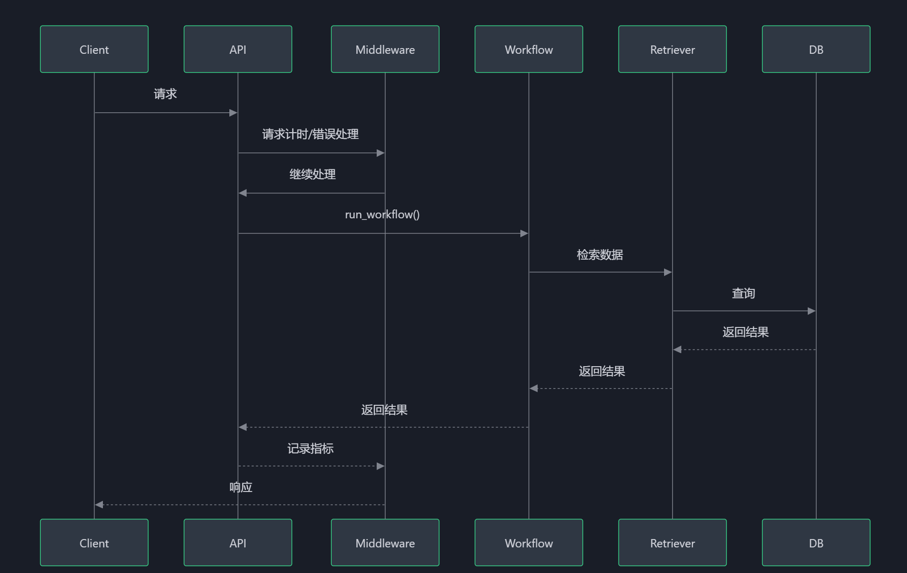
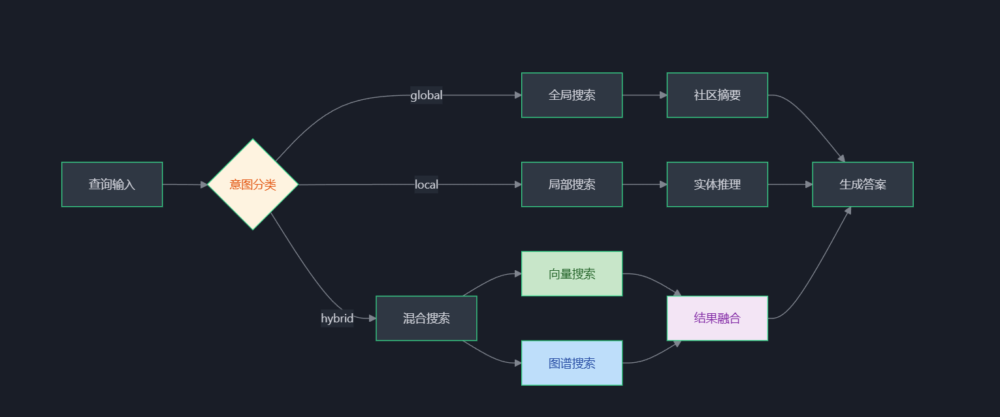

# MedicalGraph - 医疗知识图谱问答系统

基于知识图谱的医疗领域问答系统，整合大语言模型实现智能医疗咨询服务。

## 项目概述

MedicalGraph 是一个将通用知识图谱系统转型为专业医疗知识图谱的智能问答平台。系统具备医疗实体识别、关系抽取、知识融合和智能问答等核心能力，为用户提供准确、专业的医疗信息服务。

## 关键特性

- **医疗实体识别**: 支持疾病、症状、药物、检查、治疗等医疗实体的精准识别
- **知识图谱构建**: 基于 Neo4j 的医疗知识图谱存储与管理
- **智能问答引擎**: 结合向量检索与图检索的混合问答机制
- **医疗意图识别**: 支持诊断辅助、用药咨询、健康建议等多种医疗场景
- **图谱可视化**: 交互式图谱浏览与节点关系探索
- **实时响应优化**: 智能缓存机制提升响应速度

## 技术架构

```
┌─────────────────────────────────────────────────────────────┐
│                     Frontend (React)                        │
│  ┌─────────────┐ ┌─────────────┐ ┌─────────────────────┐   │
│  │ ChatView    │ │ GraphView   │ │ IngestView          │   │
│  └──────┬──────┘ └──────┬──────┘ └──────────┬──────────┘   │
└─────────┼────────────────┼───────────────────┼──────────────┘
          ▼                ▼                   ▼
┌─────────────────────────────────────────────────────────────┐
│                     Backend (FastAPI)                       │
│  ┌───────────────┐ ┌───────────────┐ ┌─────────────────┐    │
│  │ API Routes    │ │ Workflow      │ │ Retrieval       │    │
│  │ (REST API)    │ │ (LangGraph)   │ │ (Hybrid)       │    │
│  └──────┬────────┘ └──────┬────────┘ └────────┬────────┘    │
│         ▼                 ▼                  ▼              │
│  ┌─────────────────────────────────────────────────────┐    │
│  │              Knowledge Fusion Engine                 │    │
│  │  - EntityDisambiguator  - RelationAligner          │    │
│  └─────────────────────────────────────────────────────┘    │
└─────────────────────────────────────────────────────────────┘
          ▼                ▼
┌─────────────────┐  ┌─────────────────┐
│    Neo4j        │  │  Vector DB      │
│ (知识图谱存储)   │  │  (向量检索)     │
└─────────────────┘  └─────────────────┘
```

## 技术栈

| 层级   | 技术                    | 用途        |
| ---- | --------------------- | --------- |
| 前端   | React 19 + TypeScript | UI框架      |
| 前端   | Tailwind CSS 4        | 样式框架      |
| 前端   | Vis Network           | 图谱可视化     |
| 后端   | FastAPI               | API框架     |
| 后端   | Neo4j                 | 图数据库      |
| 后端   | LangChain / LangGraph | LLM集成与工作流 |
| 模型   | DashScope Qwen系列      | 大语言模型     |
| 实体识别 | BioBERT / Medical-NER | 医疗实体抽取    |

## 安装说明

### 环境要求

- Python >= 3.10
- Node.js >= 18
- Neo4j >= 5.0
- DashScope API Key

### 后端安装

```bash
cd backend
pip install -r requirements.txt
cp .env.example .env
# 编辑 .env 文件，配置 Neo4j 和 DashScope
```

### 前端安装

```bash
cd frontend
npm install
cp .env.example .env
# 编辑 .env 文件，配置 API 地址
```

### 启动服务

```bash
# 启动后端 (端口 8000)
cd backend
python -m uvicorn src.main:app --reload

# 启动前端 (端口 3000)
cd frontend
npm run dev
```

## 使用指南

### 文档入库

1. 登录系统后进入"知识入库"页面
2. 上传医疗文档（支持 PDF, DOCX, TXT, CSV）
3. 选择是否提取实体和创建向量嵌入
4. 点击"开始入库"完成文档处理

### 图谱可视化

1. 进入"图谱可视化"页面
2. 使用搜索框查找特定节点
3. 右键节点选择"展示相关联系"查看关联关系
4. 鼠标悬停节点查看详情并高亮关联节点

### 智能问答

1. 进入"医疗问答"页面
2. 输入医疗相关问题，如：
   - "糖尿病如何治疗？"
   - "感冒发烧怎么办？"
   - "高血压有哪些症状？"
3. 系统支持混合搜索和纯图谱搜索两种模式

## 开发环境

### 代码结构

```
GRAPHRAG/
├── backend/                    # 后端服务
│   ├── src/
│   │   ├── api/               # REST API 路由
│   │   ├── chains/            # LLM 链
│   │   ├── core/              # 核心组件
│   │   ├── ingestion/         # 数据入库
│   │   ├── retrieval/         # 检索模块
│   │   └── workflow/          # 工作流
│   ├── tests/                 # 测试用例
│   └── config/                # 配置文件
├── frontend/                  # 前端应用
│   ├── src/
│   │   ├── components/        # React 组件
│   │   ├── lib/               # 工具函数
│   │   └── types/             # 类型定义
│   └── tests/                 # 前端测试
└── docs/                      # 文档
```

### API 端点

| 端点                      | 方法   | 描述     |
| ----------------------- | ---- | ------ |
| `/api/v1/health`        | GET  | 健康检查   |
| `/api/v1/query`         | POST | 问答接口   |
| `/api/v1/ingest/upload` | POST | 文档上传   |
| `/api/v1/graph/data`    | GET  | 获取图谱数据 |
| `/api/v1/graph/search`  | GET  | 节点搜索   |

## 贡献指南

欢迎贡献代码！请遵循以下步骤：

1. Fork 项目
2. 创建功能分支 (`git checkout -b feature/your-feature`)
3. 提交更改 (`git commit -m 'Add some feature'`)
4. 推送到分支 (`git push origin feature/your-feature`)
5. 创建 Pull Request

### 代码规范

- Python: 遵循 PEP 8 规范
- TypeScript: 使用 ESLint 检查
- 提交信息使用约定式提交格式

## 许可证

本项目采用 MIT 许可证，详见 [LICENSE](LICENSE) 文件。

## 联系方式

- 项目维护者: MedicalGraph Team
- 邮箱: <contact@medicalgraph.dev>
- GitHub: <https://github.com/medicalgraph/GRAPHRAG>

### 关键流程分析

#### 1. 后端API流程

- **完整性**: ✅ 良好 - 覆盖搜索、查询、摄入、图谱操作等核心功能
- **错误处理**: ⚠️ 中等 - 有统一异常捕获，但缺乏细致的错误分类
- **监控能力**: ✅ 良好 - 集成Prometheus指标和请求计时


#### 2. 数据摄入流程

- **批量处理**: ✅ 良好 - 支持同步/异步批量处理
- **实体识别**: ✅ 良好 - 结合NER模型和规则匹配，具有降级能力
- **模型缓存**: ⚠️ 中等 - 使用全局变量缓存，缺乏线程安全保护


#### 3. 检索流程

- **策略多样性**: ✅ 良好 - 支持全局/局部/混合三种检索策略
- **动态Alpha**: ✅ 良好 - 根据查询意图动态调整权重
- **缓存机制**: ✅ 良好 - 使用装饰器实现查询缓存


#### 4. 工作流编排

- **熔断机制**: ✅ 良好 - 集成熔断器保护
- **异步支持**: ✅ 良好 - 提供同步/异步两种工作流
- **降级策略**: ⚠️ 中等 - 降级响应仅返回固定消息

**注意**: 本系统仅供参考和研究目的，不构成医疗建议。医疗决策请咨询专业医生。
